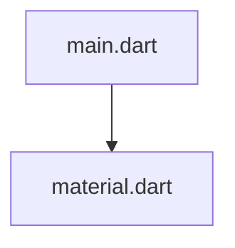

# Documentación del archivo: main.dart

## Introducción

Este archivo es el punto de entrada de la aplicación Flutter. Define el widget de la aplicación y el widget de la página principal.

## Descripción

El archivo contiene dos clases, MyApp y MyHomePage, que son StatelessWidget. MyApp es la clase raíz de la aplicación, mientras que MyHomePage es la página principal que se muestra al iniciar la aplicación. Se muestra un botón en el centro de la página, y al presionarlo, se muestra un SnackBar con un mensaje.

## Estructura

El archivo se estructura en una función main y dos clases StatelessWidget.

## Dependencias

Este archivo depende del paquete Flutter material.dart.

## Importaciones

El archivo importa 'package:flutter/material.dart'.

## Variables

No hay variables globales definidas en este archivo.

## Métodos

Este archivo define los siguientes métodos:

- `main()`: Es la función principal que se ejecuta cuando se inicia la aplicación. Llama a runApp() con una instancia de la clase MyApp.
- `build()`: Este método está definido en las clases MyApp y MyHomePage. Construye los widgets para estos componentes.

## Ejemplo

Para ejecutar este archivo, asegúrese de tener Flutter y Dart configurados en su entorno, luego ejecute el comando `flutter run` en la terminal.

## Diagrama de dependencias

## Notas

Este es un ejemplo simple de una aplicación Flutter. No tiene estado ni lógica de negocio.

## Vulnerabilidades

No se han detectado vulnerabilidades en este archivo.